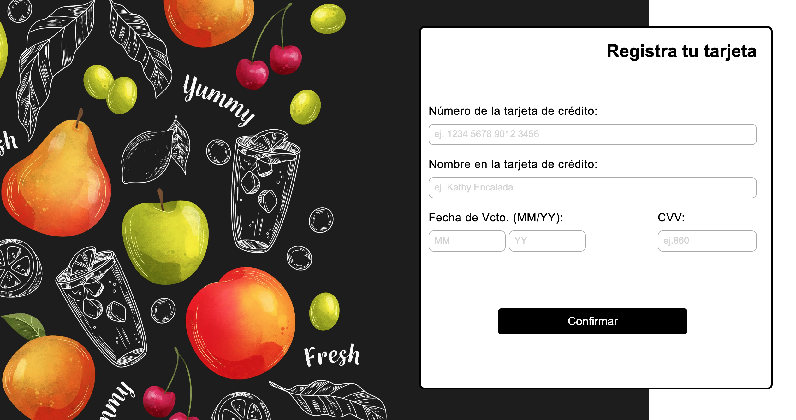
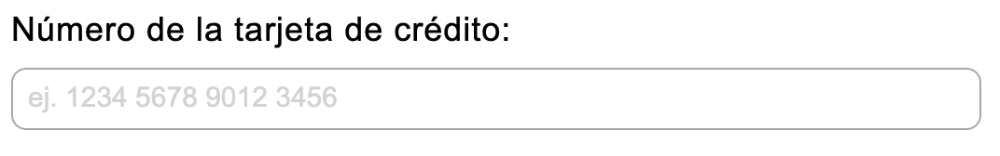
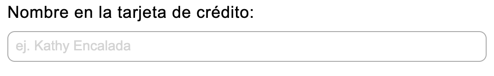
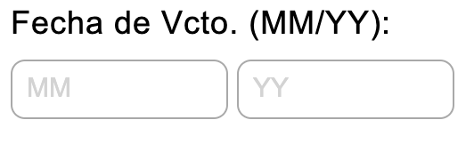
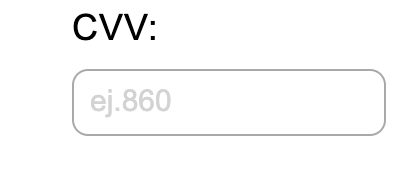
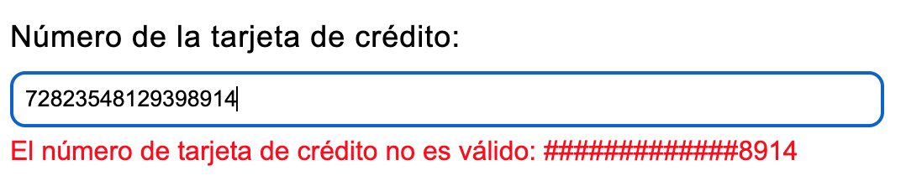
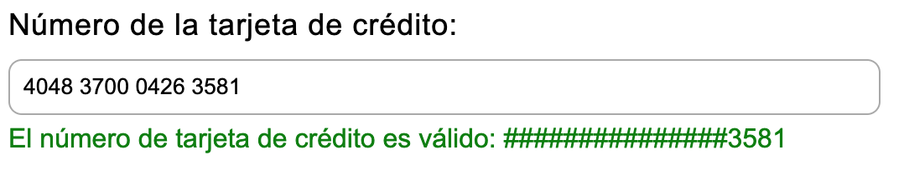
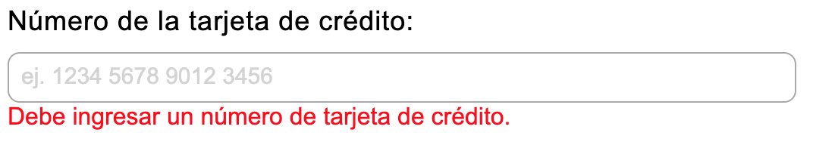

# Tarjeta de crédito válida

## Índice

* [1. Preámbulo](#1-preámbulo)
* [2. Resumen del proyecto](#2-resumen-del-proyecto)
* [3. Consideraciones generales](#3-consideraciones-generales)
* [4. Hito: Criterios de aceptación mínimos del proyecto](#4-hito-criterios-de-aceptación-mínimos-del-proyecto)
* [5. Hito Opcional: Mostrar la franquicia de tarjeta](#5-hito-opcional-mostrar-la-franquicia-de-tarjeta)
* [6. Consideraciones técnicas](#6-consideraciones-técnicas)
* [7. Objetivos de aprendizaje](#7-objetivos-de-aprendizaje)
* [8. Pistas, tips y lecturas complementarias](#8-pistas-tips-y-lecturas-complementarias)
* [9. Para considerar Project Feedback](#9-para-considerar-project-feedback)

***

## 1. Preámbulo:

El [algoritmo de Luhn](https://es.wikipedia.org/wiki/Algoritmo_de_Luhn),
también llamado algoritmo de módulo 10, es un método de suma de verificación,
se utiliza para validar números de identificación; tales como el IMEI de los
celulares, tarjetas de crédito, etc.

Este algoritmo es simple. Obtenemos la reversa del número a verificar (que
solamente contiene dígitos [0-9]); a todos los números que ocupan una posición
par se les debe multiplicar por dos, si este número es mayor o igual a 10,
debemos sumar los dígitos del resultado; el número a verificar será válido si
la suma de sus dígitos finales es un múltiplo de 10.


## 2. Resumen del proyecto:

Este es el primer proyecto del Bootcamp de Laboratoria DEV007, en el que trabajé
en solitario durante 4 semanas.

En este proyecto construí una aplicación web en donde el usuario puede validar su 
número de tarjeta de crédito. Además, implementé una funcionalidad para ocultar
todos los números de la tarjeta, excepto los últimos cuatro.

Como temática elegí una tienda de jugos y yogures a domicilio, en donde, cómo
último paso para la compra, el usuario debe registrar su tarjeta para validarla
y después continuar al pago.

Como continuación del proyecto de preadmisión, volví a trabajar sobre
fundamentos de JavaScript, incluyendo conceptos como variables, condicionales,
y funciones, así como eventos y manipulación básica del DOM, fundamentos de
HTML y CSS. Mientras desarrollé este proyecto, me familiaricé con nuevos
conceptos también.

### Los objetivos generales que desarrollé en este proyecto son los siguientes:

* Trabajé en base a un boilerplate, la estructura básica de un proyecto en
  distintas carpetas (a través modulos en JS).
* Conocí las herramientas de mantenimiento y mejora del código (linters y
  pruebas unitarias).
* Aprendí sobre objetos, estructuras, métodos e iteración (bucles)
  en JavaScript
* Implementé control de versiones con git (y la plataforma github)

## 3. Consideraciones generales

* Este proyecto lo resolví de manera **individual**.
* El rango de tiempo que duré en completar el proyecto fue de 4 Sprints.
* Me enfoqué en aprender y no solamente en "completar" el proyecto.

## 4. Hito: Criterios de aceptación mínimos del proyecto

Estos son los requisitos que mi proyecto cumple para asegurar que mi
trabajo cubra los objetivos principales.

**1. Una interfaz que debe permitir a la usuaria:**

* Insertar un numero (texto) que quieres validar. Usa solo caracteres numéricos
  (dígitos) en la tarjeta a validar [0-9].  
* Ver si el resultado es válido o no.  
* Ocultar todos los dígitos del número de tarjeta a exepción de los últimos
  4 caracteres.  
* No debes poder ingresar un campo vacío.  

**2. Pruebas unitarias de los métodos.**  
Los metódos de `validator` (`isValid` y `maskify`) deben tener cobertura con
pruebas unitarias.

**3. Código de tu proyecto subido a tu repo e interfaz "desplegada".**  
El código final debe estar subido en un repositorio en GitHub. La interfaz o
pagina web, debe ser "desplegada" (accesible públicamente online) usando
GitHub Pages.
  
**4. Un README que contiene una definición del producto.**  
En el README cuéntanos cómo pensaste en los usuarios y cuál fue tu proceso
para definir el producto final a nivel de experiencia y de interfaz.  
Estas preguntas sirven como guía:

* Quiénes son los principales usuarios de producto.
* Cuáles son los objetivos de estos usuarios en relación con tu producto.
* Cómo crees que el producto que estás creando está resolviendo sus problemas.

## 5. Consideraciones técnicas

En el inicio de mi proyecto se me entregó un boilerplate, que es la estructura
básica de este proyecto y sirve como punto de inicio.

El boilerplate entregado tiene la siguiente estructura:

```text
./
├── .babelrc
├── .editorconfig
├── .eslintrc
├── .gitignore
├── README.md
├── package.json
├── src
│   ├── validator.js
│   ├── index.html
│   ├── index.js
│   └── style.css
└── test
    ├── .eslintrc
    └── validator.spec.js
```

La lógica del proyecto está implementada completamente en JavaScript. En
este proyecto NO se usó librerías o frameworks, solo Vanilla JavaScript.

***
## 6. Desarrollo del proyecto

**1. Pagina para validar la Tarjeta de Crédito:**

Cuando haya realizado la compra de los jugos y/o yogures e indicado la ubicación de envío, llegará a esta página de validación:



**2. Encabezado de página:**

Invita a registrar Tarjeta.


**3. Caja ingreso números de tarjeta:**

Insertar números de tarjeta a validar.



**4. Caja nombre del Titular de la Tarjeta:**

Ingresar en nombre del Titular de la Tarjeta.



**4. Fecha de vencimiento de tarjeta:**

La misma tarjeta a validar entrega una fecha de vencimiento (Fecha de Vcto.). Se debe ingresar esa fecha (mes y año).



**5. Código de Verificación:**

La parte trasera de la tarjeta entrega un digito de tres números, ese es su código (CVV), el cual debe ingresa en la caja CVV.



**6. Validación:**

Después de ingresar el número de la Tarjeta, y pasar a la siguiente entrada de datos se validará el número de la Tarjeta:

Tendremos dos mensajes disponibles:

"El número de tarjeta de crédito no es válido: ###########7143"



"El número de tarjeta de crédito es válido: ###############3581"



Si se intenta registrar la Tarjeta, dándole click al botón de "confirmar" sin antes ingresar un número de Tarjeta, presentará el siguiente mensaje:

"Debe ingresar un número de tarjeta de crédito."


